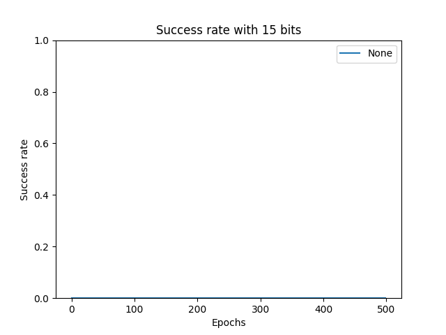
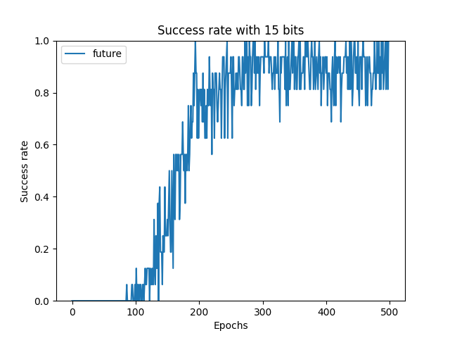
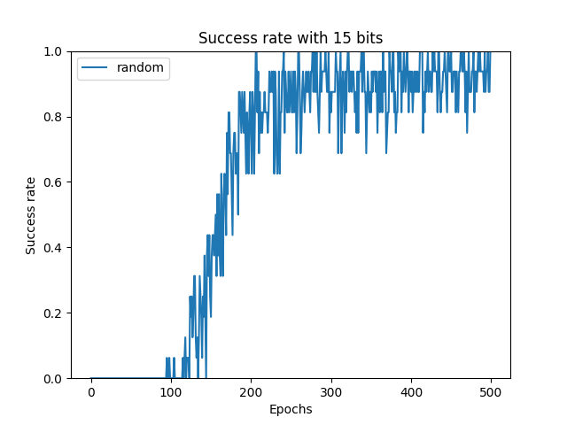
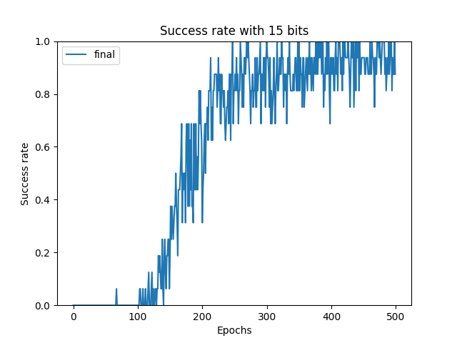
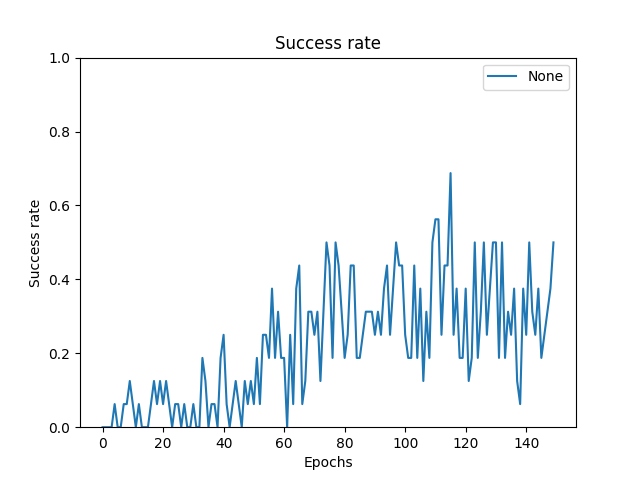
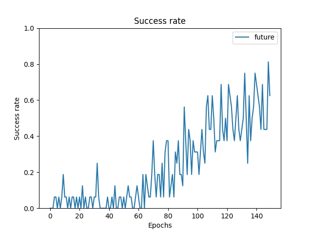
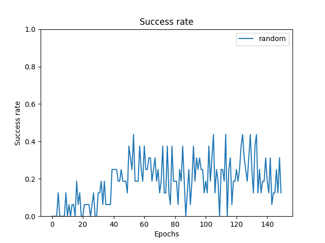
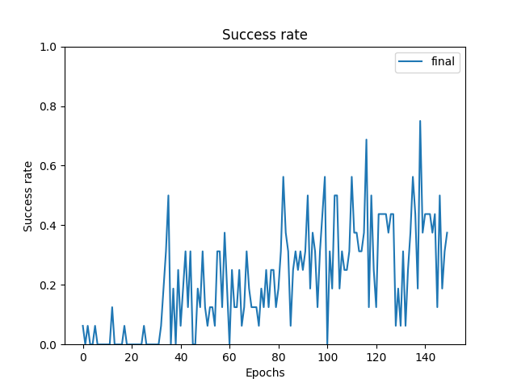

### HW3 (Hindsight Experience Replay)

#### Part 1: BitsEnv
```
python bits_main.py --num_bits=15 --num_epochs=500 --HER=REPLACEME
```
* In this particular setting, DQN learns nothing without HER. 






#### Part 2: SaywerEnv
```
python sawyer_main.py --num_epochs=150 --steps_per_episode=50 --HER=REPLACEME
```
* To install multiworld, run `pip install -e git+https://github.com/vitchyr/multiworld/#egg=multiworld`. 
* In `SawyerReachXYEnv-v1`, using HER with strategy = `future` gives the best performance. 
This is consistent with OpenAI [baselines](https://github.com/openai/baselines/blob/master/baselines/her/her_sampler.py). 
* However, the density of substituted transitions 
(`num_relabeled = 4` per episode according to the default hyperparameter in `sawyer_main.py`) is much less than 
the official implementation. 
* According to the instruction, 
the reward function is the negative Euclidean distance between the 2D goal and state vector. 
From the first glance it seems not the case according to [multiworld](https://github.com/vitchyr/multiworld/blob/ac21a44d96fa3dad16158192be6473122979aa66/multiworld/envs/mujoco/sawyer_xyz/sawyer_reach.py#L171),
where the reward is determined by 3D vecotrs. 








